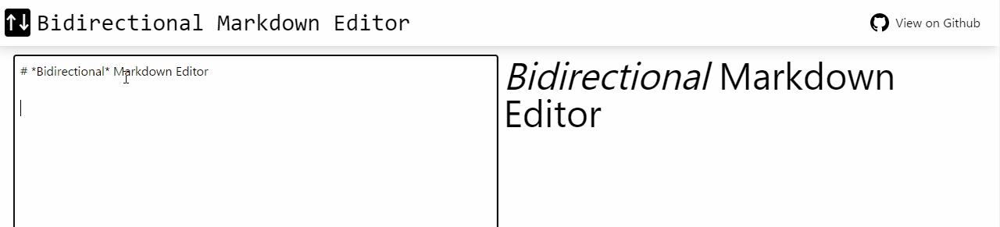

# Bidirectional Markdown Editor [Concept]

There are two types of Markdown editors: standard Markdown editors, which consist of a text area and a preview (used when editing README files on GitHub), and rich editors (WYSIWYG). However, both have their pros and cons.

### Standard Markdown editors

- easy to edit the link url [pro]
- you don't have to wait to export the source [pro]
- not intuitive [con]

### Rich editors

- intuitive [pro]
- hard to edit the link url [con]
- you have to wait to export the source [con]

So, I thought it would be nice if there were a standard Markdown editor, but where the preview could also be edited.

## Before you read the source code

**Warning: The source code is terrible**

This is project for proving a concept, and I'm not used to React yet, so please don't judge my awful code

## Demo

You can try it [here](https://renkr.github.io/bidirectional-markdown-editor/)
